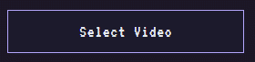

> RIGHT FUCKING NOW

> *WAKING THE SERVER UP xD*


> *and copy room code...*
```
└── NETSYNC/
    ├── server.js
    ├── index.html
    └── style.css
```

> DON'T REFRESH THE PAGE

> LET THE HOST COOK


> DON'T CLICK *[AS HOST]*
>
> _Subtitles Does Not Works_ 
>
> ***DON'T KNOW IF IT WORKS [FR]*** 
